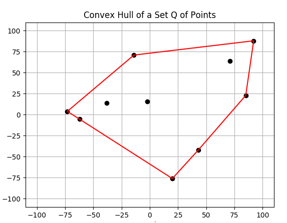

# Graham Scan Project #  
 
 ## Description ##  
 This is an implementation of the Graham Scan algorithm to compute the convex hull of a set of points.  
 This was written as a project for an undergraduate level algorithms course.  
 The program is written in C and the results are printed using Matplotlib in Python.  
 
 

      

 
 ## Code Structure ##  
 **convex_hull.c**  
  - Takes file input from stdin, file containing a set of points.  
  - Executes Graham Scan algorithm to compute convex hull from set of points.  
  - Prints original set of points and convex hull into a file titled results.txt, which is formated for use with plot.py.  
  
 **generate_tests.c**  
 - Using random numbers, generates two test files titled rand1.txt and rand2.txt    
 - rand1.txt contains 10 random points between -100 and 100.  
 - rand2.txt contains 1000 random points between -100 and 100  

**plot.py** 
 - Takes file input as a command line argument, for this project this file is results.txt  
 - Creates a scatter plot of the data and highlights the convex hull.  

**.txt files**  
 - Each of these files except for results.txt are different data sets.
 - Each data set may be run with convex_hull.c to produce a different results.txt.
 
## Compiling and Running ##  
The following instructions are for a Linux operating system.  
**convex_hull.c**  
COMPILATION:  
 - gcc -o convex_hull convex_hull.c -lm -std=c99  

EXECUTION:  
 - ./convex_hull < data.txt
 - NOTE: data.txt must comply to a specific format:  
            line 1: integer that represents the number of points in the set.  
            line 2: two integers separated by a space representing x and y.  
            ...  
            line N+1: repeat format of line 2 up to N, the number of points.  

**generate_tests.c**  
COMPILATION:  
 - gcc -o generate_tests generate_tests.c -std=c99  

EXECUTION:  
- ./generate_tests  

**plot.py**  
REQUIRED MODULES  
 - Matplotlib  

EXECUTION:  
 - python plot.py results.txt  

